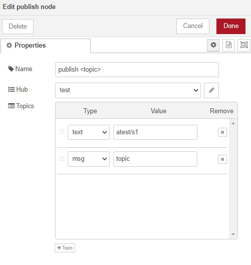
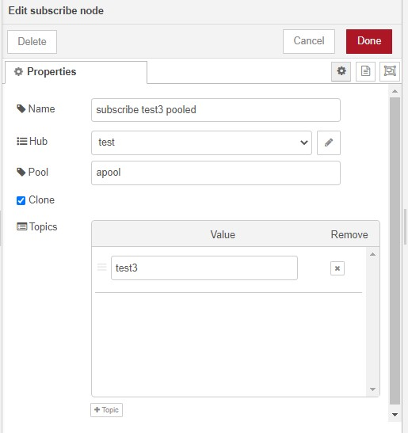
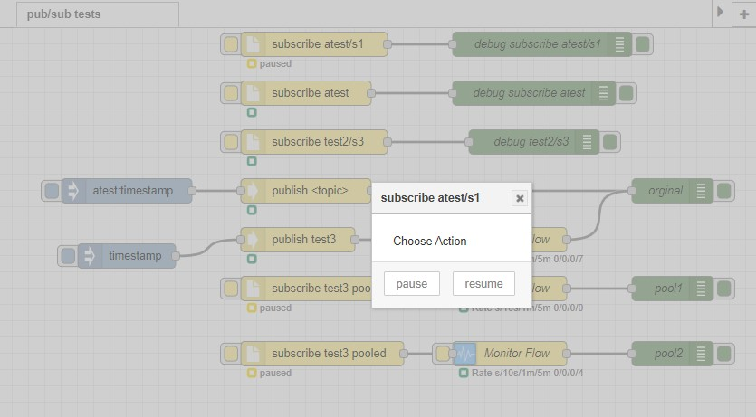
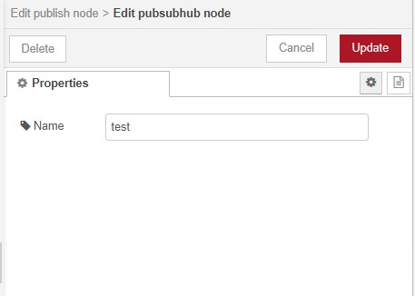

# node-red-contrib-pubsubhub

Provided publish/subscribe frame work with nodered.  This allows for complete independence of development between flows and allowing dynamic growth.  Helpful with complex flows. 
Pause/resume facility allows process flows to be bypassed dynamically.
A message can be processed by multiple flows as clones or as same message.

------------------------------------------------------------

# Publish

Simply publishes a message to the message hub using a topic which can be predefined or used topic of message.

------------------------------------------------------------

# Subscribe

Registers interest in a topic.
More than one node can register an interest.
Message can be cloned to ensure not impacted by other subscribers.
Subscriber nodes can be pooled to the one id for a topic leaf so they round robin so only one processes a message.

## Pause/Resume Subscription

It is possible to pause and resume a subscription.
Note it means messages that would have been processed are are lost unless pooled which mean processed by another subscribe node in the pool.

 

------------------------------------------------------------

# Hub

------------------------------------------------------------

# Future Improvements

* connect to other nodered instances
* Start subscribe in paused state
* Allow pass thru message to be held back until triggered by a subscription

------------------------------------------------------------

# Install

Run the following command in the root directory of your Node-RED install or via GUI install

	npm install node-red-contrib-pubsubhub

------------------------------------------------------------

# Version

0.0.2 Initial release

# Author

[Peter Prib][3]

[1]: http://nodered.org "node-red home page"

[2]: https://www.npmjs.com/package/node-red-contrib-pubsub "source code"

[3]: https://github.com/peterprib "base github"
